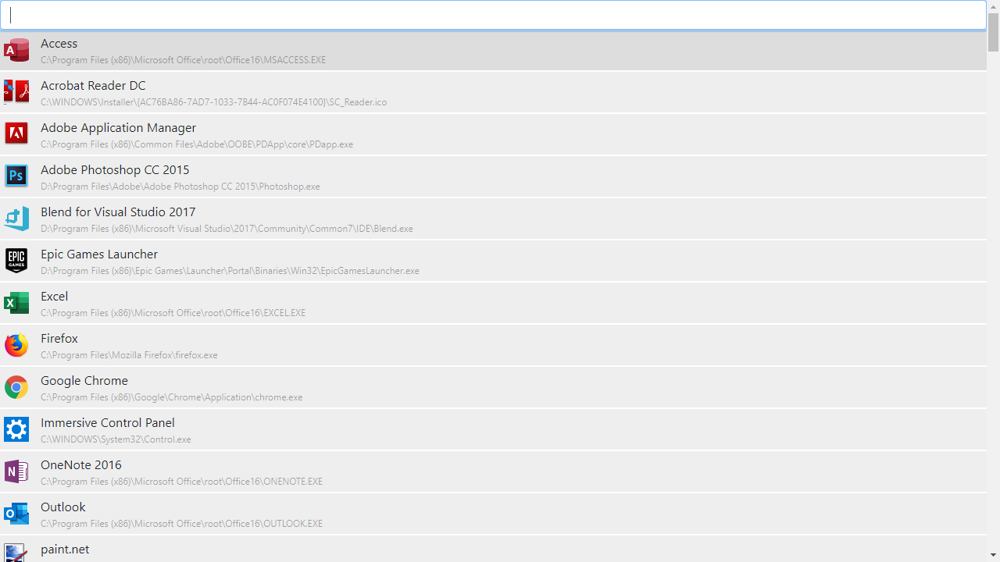

# Vender
An Electron application designed to make your apps more accessible.
The application "indexes" shortcuts & links in your computer and allows you to access them in a fast and simple way.

* Special note - there is actually a sub-project "vender-utils" which handles the low-level WinAPI side of the app.

### Screenshot:

